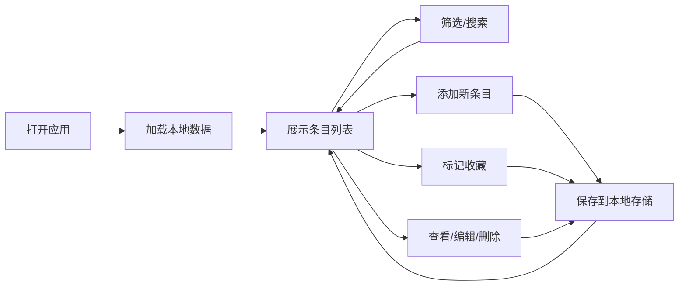

## 1. 产品概述

同人CP粮单整理工具，专为同人爱好者设计的个人粮单管理系统。帮助用户系统化整理收藏的同人作品，支持多维度筛选检索，让大量条目也能快速定位。

- 核心目标：解决同人爱好者「粮太多找不到」的痛点，提供便捷的录入、筛选、收藏、检索功能
- 目标用户：同人圈读者、产粮者
- 产品价值：打造个人专属的同人文库，提升阅片/读文效率

## 2. 核心功能

### 2.1 用户角色
| 角色 | 注册方式 | 核心权限 |
|------|----------|----------|
| 普通用户 | 无需注册，本地使用 | 完整的录入、编辑、删除、筛选、收藏功能 |

### 2.2 功能模块
1. **条目录入模块**：添加新的同人作品条目
2. **条目列表模块**：展示所有条目，支持无限滚动/虚拟滚动
3. **筛选检索模块**：多条件组合筛选和关键词搜索
4. **收藏管理模块**：标记和查看收藏条目
5. **数据持久化模块**：本地存储，数据不丢失

### 2.3 页面详情
| 页面名称 | 模块名称 | 功能描述 |
|---------|----------|----------|
| 首页（单页应用） | 顶部导航 | Logo、搜索框、添加按钮、筛选切换 |
| 首页 | 录入表单 | 作品名、CP名、类型、链接、作者、状态、标签、阅读状态、备注 |
| 首页 | 筛选面板 | CP筛选、类型筛选、标签筛选、阅读状态筛选、收藏筛选 |
| 首页 | 条目列表 | 卡片式展示，支持收藏标记、快速编辑、删除 |
| 首页 | 详情弹窗 | 查看完整条目信息，支持编辑 |

## 3. 核心流程

用户打开应用 → 查看已有条目列表 → 可通过筛选器/搜索快速定位 → 点击「添加」录入新条目 → 可标记收藏 → 点击条目查看详情/编辑/删除 → 所有操作自动保存到本地

## 4. 用户界面设计

### 4.1 设计风格
- **美学方向**：柔和治愈系，搭配精致的细节动效。适合长时间阅读浏览的护眼配色
- **主色调**：柔和的薰衣草紫 `#9b87f5` 作为主色，温暖的蜜桃色 `#f7a1a1` 作为收藏强调色
- **辅助色**：柔和的薄荷绿 `#7fd1b9` 标记已读，淡粉 `#ffc8dd` 标记甜，淡蓝 `#bde0fe` 标记虐
- **背景**：渐变底色 + 微妙的噪点纹理，营造温暖氛围
- **字体**：使用「Quicksand」作为标题字体，圆润可爱；「Lora」作为正文字体，优雅易读
- **卡片风格**：圆角 + 柔和阴影 + 悬浮时微妙上浮动效
- **按钮风格**：圆角胶囊型，点击有缩放反馈

### 4.2 页面设计概述
| 页面名称 | 模块名称 | UI元素 |
|---------|----------|--------|
| 首页 | 顶部导航 | 渐变背景、发光Logo、圆角搜索框、胶囊型按钮 |
| 首页 | 录入表单 | 双列布局、柔和边框、标签式输入、顺滑展开收起动画 |
| 首页 | 筛选面板 | 标签云样式、多列布局、选中状态高亮发光 |
| 首页 | 条目列表 | 瀑布流/网格布局、卡片悬浮动效、收藏按钮心跳动画 |
| 首页 | 详情弹窗 | 毛玻璃背景、居中弹窗、平滑过渡动画 |

### 4.3 响应式
- 桌面端优先设计，三列卡片布局
- 平板端自适应两列布局
- 移动端单列布局，筛选面板可折叠
- 触控区域优化，按钮最小44x44px

### 4.4 交互动效
- 页面加载时卡片依次淡入（staggered reveal）
- 收藏按钮点击时有心跳缩放动画
- 筛选切换时有平滑过渡
- 卡片悬浮时轻微上浮 + 阴影加深
- 表单展开/收起有高度过渡动画
