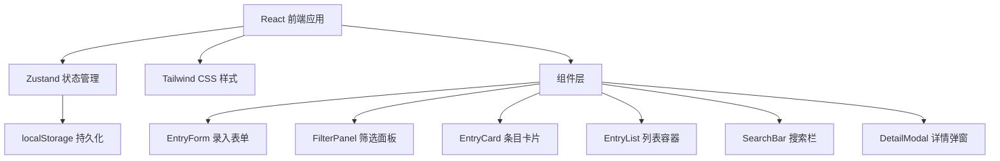
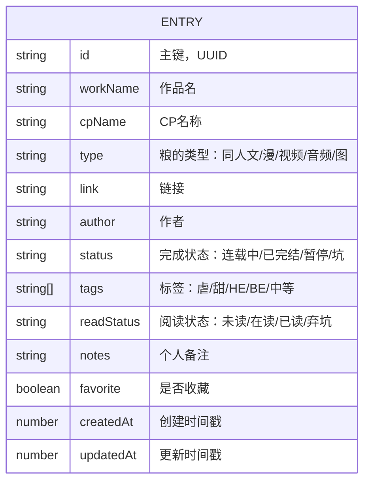

## 1. 架构设计



## 2. 技术描述
- **前端框架**：React@18 + TypeScript + Vite
- **状态管理**：Zustand（轻量级，适合本地数据管理）
- **样式方案**：Tailwind CSS 3.x
- **图标库**：lucide-react
- **数据存储**：浏览器 localStorage
- **性能优化**：useMemo/useCallback 优化筛选渲染，虚拟滚动（可选）

## 3. 路由定义
| 路由 | 用途 |
|------|------|
| / | 主页面（单页应用，无额外路由） |

## 4. 数据模型

### 4.1 数据模型定义


### 4.2 类型定义
```typescript
type EntryType = '同人文' | '同人漫' | '视频' | '音频' | '图' | '其他';
type CompletionStatus = '连载中' | '已完结' | '暂停' | '坑';
type ReadStatus = '未读' | '在读' | '已读' | '弃坑';
type FlavorTag = '虐' | '甜' | '中等' | 'HE' | 'BE' | 'OE' | '车' | '清水';

interface Entry {
  id: string;
  workName: string;
  cpName: string;
  type: EntryType;
  link: string;
  author: string;
  status: CompletionStatus;
  tags: FlavorTag[];
  readStatus: ReadStatus;
  notes: string;
  favorite: boolean;
  createdAt: number;
  updatedAt: number;
}

interface FilterState {
  cpName: string;
  type: EntryType | 'all';
  tags: FlavorTag[];
  readStatus: ReadStatus | 'all';
  favoriteOnly: boolean;
  searchKeyword: string;
}
```

### 4.3 存储结构
- localStorage key: `cp-grain-list-data`
- 存储格式：JSON 字符串，包含所有 entries 数组
- 数据变更时自动序列化保存
